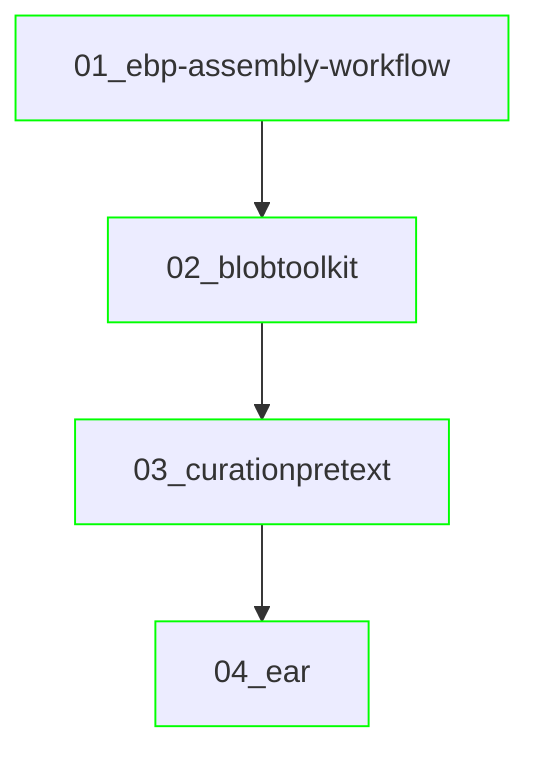

# Analysis history

This history file communicates the strategy followed to obtain the frozen results.
This is useful for longer projects to describe how and why certain analyses
were performed, and which analyses lead to what.

## Overview

Use a mermaid diagram to visually describe how folders relate each other.
A `flowchart` is an example that can be used to display the folder relationships.

